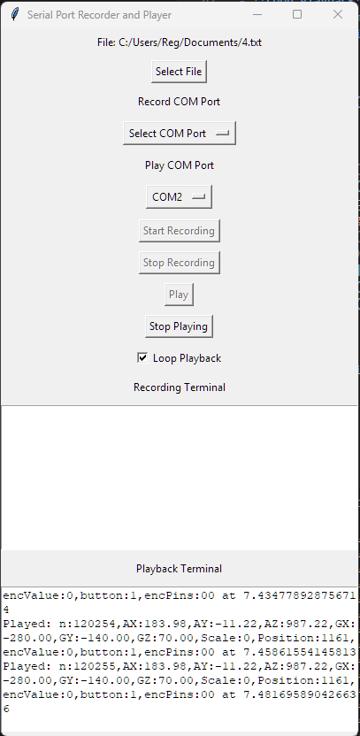

# FakeSerial

FakeSerial is a Python application that allows you to record data from a serial port and play it back with the same timing. It also provides an option to loop the playback.

## Features

- List available COM ports
- Record data from a selected COM port with timestamps
- Play recorded data to a selected COM port based on timestamps
- Loop playback option
- Simple GUI using Tkinter

## Requirements

- Python 3.x
- `pyserial` library
- `tkinter` library

## Installation

1. Clone the repository:
    ```sh
    git clone https://github.com/yourusername/FakeSerial.git
    cd FakeSerial
    ```

2. Install the required libraries:
    ```sh
    pip install pyserial
    ```

## Usage

1. Run the application:
    ```sh
    python fakeserial.py
    ```

2. Select a file to save the recorded data.

3. Select the COM port for recording and playback.

4. Click "Start Recording" to begin recording data from the selected COM port.

5. Click "Stop Recording" to stop recording data.

6. Click "Play" to play the recorded data to the selected COM port.

7. Check the "Loop Playback" checkbox if you want to loop the playback.

8. Click "Stop Playing" to stop the playback.

## GUI Components

- **Select File**: Button to select a file to save the recorded data.
- **Record COM Port**: Dropdown menu to select the COM port for recording.
- **Play COM Port**: Dropdown menu to select the COM port for playback.
- **Start Recording**: Button to start recording data.
- **Stop Recording**: Button to stop recording data.
- **Play**: Button to start playing the recorded data.
- **Stop Playing**: Button to stop playing the recorded data.
- **Loop Playback**: Checkbox to enable or disable loop playback.
- **Recording Terminal**: Text area to display recorded data.
- **Playback Terminal**: Text area to display played data.

## Screenshot



## Code Overview

- [list_com_ports()](http://_vscodecontentref_/0): Function to list available COM ports.
- [record_data()](http://_vscodecontentref_/1): Function to read data from the selected COM port and record it to a file with timestamps.
- [play_data()](http://_vscodecontentref_/2): Function to play recorded data from a file to the selected COM port based on timestamps.
- [start_recording()](http://_vscodecontentref_/3): Function to start recording.
- [stop_recording()](http://_vscodecontentref_/4): Function to stop recording.
- [start_playing()](http://_vscodecontentref_/5): Function to start playing.
- [stop_playing()](http://_vscodecontentref_/6): Function to stop playing.
- [select_file()](http://_vscodecontentref_/7): Function to select a file.
- [toggle_loop()](http://_vscodecontentref_/8): Function to toggle loop playback.

## License

This project is licensed under the MIT License. See the LICENSE file for details.